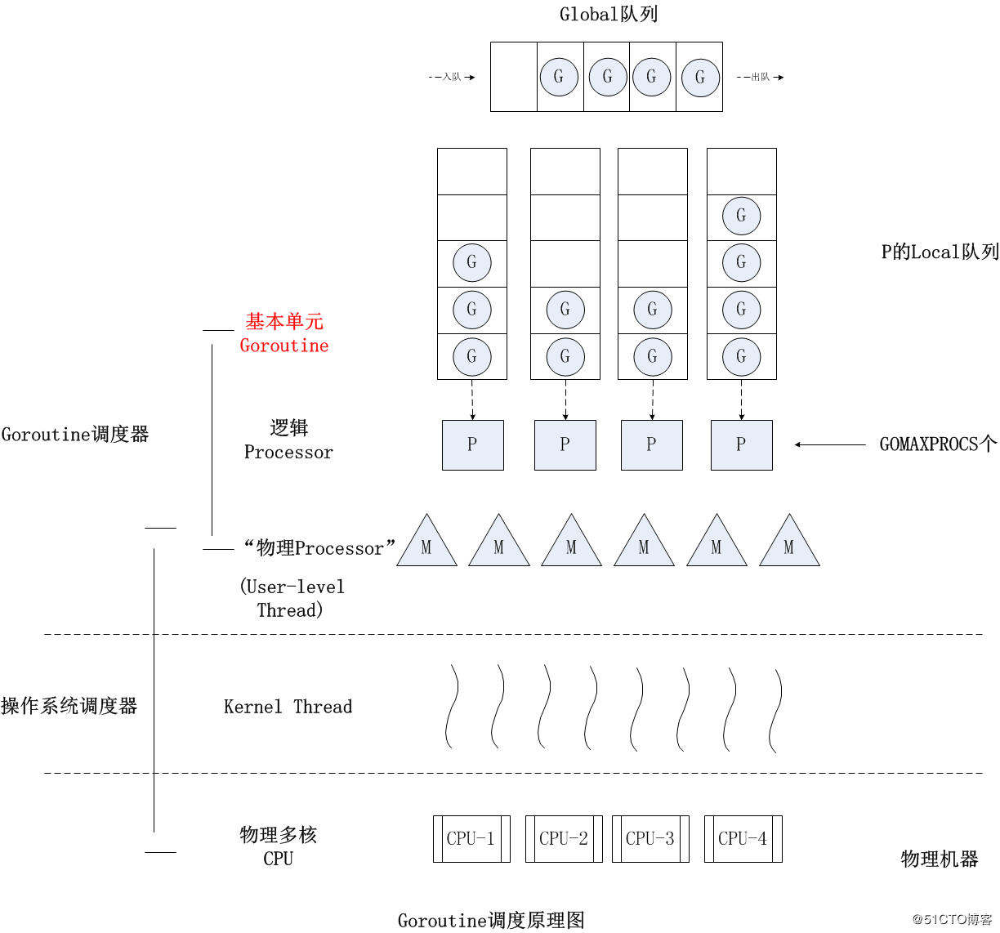
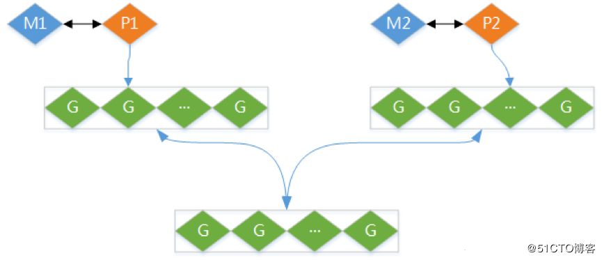

## 一、goroutine简介
### 1、并发与并行简介
并行(parallel)：指在同一时刻，有多条指令在多个处理器上同时执行。
并发(concurrency)：指在同一时刻只能有一条指令执行，但多个进程指令被快速的轮换执行，使得在宏观上具有多个进程同时执行的效果，但在微观上并不是同时执行的，只是把时间分成若干段，使多个进程快速交替的执行。
并行在多处理器系统中存在，而并发可以在单处理器和多处理器系统中都存在，并发能够在单处理器系统中存在是因为并发是并行的假象，并行要求程序能够同时执行多个操作，而并发只是要求程序假装同时执行多个操作（每个小时间片执行一个操作，多个操作快速切换执行）。 

### 2、Coroutine简介
Coroutine（协程）是一种用户态的轻量级线程，特点如下：
A、轻量级线程
B、非抢占式多任务处理，由协程主动交出控制权。
C、编译器/解释器/虚拟机层面的任务
D、多个协程可能在一个或多个线程上运行。
E、子程序是协程的一个特例。
不同语言对协程的支持：
A、C++通过Boost.Coroutine实现对协程的支持
B、Java不支持
C、Python通过yield关键字实现协程，Python3.5开始使用async def对原生协程的支持

### 3、goroutine简介
在Go语言中，只需要在函数调用前加上关键字go即可创建一个并发任务单元，新建的任务会被放入队列中，等待调度器安排。
进程在启动的时候，会创建一个主线程，主线程结束时，程序进程将终止，因此，进程至少有一个线程。main函数里，必须让主线程等待，确保进程不会被终止。
go语言中并发指的是让某个函数独立于其它函数运行的能力，一个goroutine是一个独立的工作单元，Go的runtime（运行时）会在逻辑处理器上调度goroutine来运行，一个逻辑处理器绑定一个操作系统线程，因此goroutine不是线程，是一个协程。
进程：一个程序对应一个独立程序空间
线程：一个执行空间，一个进程可以有多个线程
逻辑处理器：执行创建的goroutine，绑定一个线程
调度器：Go运行时中的，分配goroutine给不同的逻辑处理器
全局运行队列：所有刚创建的goroutine队列
本地运行队列：逻辑处理器的goroutine队列
当创建一个goroutine后，会先存放在全局运行队列中，等待Go运行时的调度器进行调度，把goroutine分配给其中的一个逻辑处理器，并放到逻辑处理器对应的本地运行队列中，最终等着被逻辑处理器执行即可。
Go的并发是管理、调度、执行goroutine的方式。
默认情况下，Go默认会给每个可用的物理处理器都分配一个逻辑处理器。
可以在程序开头使用runtime.GOMAXPROCS(n)设置逻辑处理器的数量。
如果需要设置逻辑处理器的数量，一般采用如下代码设置：
runtime.GOMAXPROCS(runtime.NumCPU())
对于并发，Go语言本身自己实现的调度，对于并行，与物理处理器的核数有关，多核就可以并行并发，单核只能并发。

### 4、goroutinue使用示例
在Go语言中，只需要在函数调用前加上关键字go即可创建一个并发任务单元，新建的任务会被放入队列中，等待调度器安排。
```go
package main

import (
   "fmt"
   "sync"
)

func main(){
   var wg sync.WaitGroup
   wg.Add(2)
   go func() {
      defer wg.Done()
      for i := 0; i < 10000; i++ {
         fmt.Printf("Hello,Go.This is %d\n", i)
      }
   }()
   go func() {
      defer wg.Done()
      for i := 0; i < 10000; i++ {
         fmt.Printf("Hello,World.This is %d\n", i)
      }
   }()
   wg.Wait()
}
```
sync.WaitGroup是一个计数的信号量，使main函数所在主线程等待两个goroutine执行完成后再结束，否则两个goroutine还在运行时，主线程已经结束。
sync.WaitGroup使用非常简单，使用Add方法设设置计数器为2，每一个goroutine的函数执行完后，调用Done方法减1。Wait方法表示如果计数器大于0，就会阻塞，main函数会一直等待2个goroutine完成再结束。

### 5、goroutine的本质
goroutine是轻量级的线程，占用的资源非常小(Go将每个goroutine stack的size默认设置为2k)线程的切换由操作系统控制，而goroutine的切换则由用户控制。
goroutinue本质上是协程。
 goroutinue可以实现并行，即多个goroutinue可以在多个处理器同时运行，而协程同一时刻只能在一个处理器上运行。
goroutine之间的通信是通过channel，而协程的通信是通过yield和resume()操作。

## 二、goroutine调度机制
### 1、线程调度模型
高级语言对内核线程的封装实现通常有三种线程调度模型：
A、N:1模型。N个用户空间线程在1个内核空间线程上运行，优势是上下文切换非常快但无法利用多核系统的优点。
B、1:1模型。1个内核空间线程运行一个用户空间线程，充分利用了多核系统的优势但上下文切换非常慢，因为每一次调度都会在用户态和内核态之间切换。
C、M:N模型。每个用户线程对应多个内核空间线程，同时也可以一个内核空间线程对应多个用户空间线程，使用任意个内核模型管理任意个goroutine，但缺点是调度的复杂性。

### 2、Go调度器简介
Go的最小调度单元为goroutine，但操作系统最小的调度单元依然是线程，所以go调度器（go scheduler）要做的工作是如何将众多的goroutine放在有限的线程上进行高效而公平的调度。
操作系统的调度不失为高效和公平，比如CFS调度算法。go引入goroutine的核心原因是goroutine轻量级，无论是从进程到线程，还是从线程到goroutine，其核心都是为了使调度单元更加轻量级，可以轻易创建几万几十万的goroutine而不用担心内存耗尽等问题。go引入goroutine试图在语言内核层做到足够高性能得同时（充分利用多核优势、使用epoll高效处理网络／IO、实现垃圾回收等机制）尽量简化编程。

### 3、Go调度器实现原理
 Go 1.1开始，Go scheduler实现了M:N的G-P-M线程调度模型，即任意数量的用户态goroutine可以运行在任意数量的内核空间线程线程上，不仅可以使上线文切换更加轻量级，又可以充分利用多核优势。 

为了实现M：N线程调度机制，Go引入了3个结构体：
M：操作系统的内核空间线程
G：goroutine对象，G结构体包含调度一个goroutine所需要的堆栈和instruction pointer（IP指令指针），以及其它一些重要的调度信息。每次go调用的时候，都会创建一个G对象。
P：Processor，调度的上下文，实现M：N调度模型的关键，M必须拿到P才能对G进行调度，P限定了go调度goroutine的最大并发度。每一个运行的M都必须绑定一个P。
P的个数是GOMAXPROCS（最大256），启动时固定，一般不修改； M的个数和P的个数不一定相同（会有休眠的M或者不需要太多的M）；每一个P保存着本地G任务队列，也能使用全局G任务队列。


全局G任务队列会和各个本地G任务队列按照一定的策略互相交换。
P是用一个全局数组（255）来保存的，并且维护着一个全局的P空闲链表。
每次调用go的时候，都会：
A、创建一个G对象，加入到本地队列或者全局队列
B、如果有空闲的P，则创建一个M
C、M会启动一个底层线程，循环执行能找到的G任务
D、G任务的执行顺序是先从本地队列找，本地没有则从全局队列找（一次性转移(全局G个数/P个数）个，再去其它P中找（一次性转移一半）。
E、G任务执行是按照队列顺序（即调用go的顺序）执行的。
创建一个M过程如下：
A、先找到一个空闲的P，如果没有则直接返回。
B、调用系统API创建线程，不同的操作系统调用方法不一样。
C、 在创建的线程里循环执行G任务
如果一个系统调用或者G任务执行太长，会一直占用内核空间线程，由于本地队列的G任务是顺序执行的，其它G任务就会阻塞。因此，Go程序启动的时候，会专门创建一个线程sysmon，用来监控和管理，sysmon内部是一个循环：
A、记录所有P的G任务计数schedtick，schedtick会在每执行一个G任务后递增。
B、如果检查到 schedtick一直没有递增，说明P一直在执行同一个G任务，如果超过一定的时间（10ms），在G任务的栈信息里面加一个标记。
C、G任务在执行的时候，如果遇到非内联函数调用，就会检查一次标记，然后中断自己，把自己加到队列末尾，执行下一个G。
D、如果没有遇到非内联函数（有时候正常的小函数会被优化成内联函数）调用，会一直执行G任务，直到goroutine自己结束；如果goroutine是死循环，并且GOMAXPROCS=1，阻塞。

### 4、抢占式调度
Go没有时间片的概念。如果某个G没有进行system call调用、没有进行I/O操作、没有阻塞在一个channel操作上，M通过抢占式调度让长任务G停下来并调度下一个G。
除非极端的无限循环或死循环，否则只要G调用函数，Go runtime就有抢占G的机会。Go程序启动时，Go runtime会启动一个名为sysmon的M(一般称为监控线程)，sysmon无需绑定P即可运行。sysmon是GO程序启动时创建的一个用于监控管理的线程。
sysmon每20us~10ms启动一次，sysmon主要完成如下工作：
A、释放闲置超过5分钟的span物理内存；
B、如果超过2分钟没有垃圾回收，强制执行；
C、将长时间未处理的netpoll结果添加到任务队列；
D、向长时间运行的G任务发出抢占调度；
E、收回因syscall长时间阻塞的P；
如果一个G任务运行10ms，sysmon就会认为其运行时间太久而发出抢占式调度的请求。一旦G的抢占标志位被设为true，那么待G下一次调用函数或方法时，runtime便可以将G抢占，并移出运行状态，放入P的local runq中，等待下一次被调度。

## 三、runtime包
### 1、Gosched
runtime.Gosched()用于让出CPU时间片，让出当前goroutine的执行权限，调度器安排其它等待的任务运行，并在下次某个时候从该位置恢复执行。

### 2、Goexit
调用runtime.Goexit()将立即终止当前goroutine执⾏，调度器确保所有已注册defer延迟调用被执行。

### 3、GOMAXPROCS
调用runtime.GOMAXPROCS()用来设置可以并行计算的CPU核数的最大值，并返回设置前的值。

## 四、Channel通道
### 1、Channel简介
Channel是goroutine之间通信的通道，用于goroutine之间发消息和接收消息。Channel是一种引用类型的数据，可以作为参数，也可以作为返回值。

### 2、Channel的创建
channel声明使用chan关键字，channel的创建需要指定通道中发送和接收数据的类型。
使用make来建立一个信道:
```go
var channel chan int = make(chan int)
// 或channel := make(chan int)
```
make有第二个参数，用于指定通道的大小。

### 3、Channel的操作
```go
//发送数据：写
channel<- data
//接收数据：读
data := <- channel
```
关闭通道：发送方关闭通道，用于通知接收方已经没有数据
关闭通道后，其它goroutine访问通道获取数据时，得到零值和false
有条件结束死循环：
```go
for{
   v ,ok := <- chan
   if ok== false{
      //通道已经关闭。。
      break
   }
}
```
```go
//循环从通道中获取数据，直到通道关闭。
for v := range channel{
   //从通道读取数据
}
```
Channel使用示例如下：
```go
package main

import (
   "fmt"
   "time"
)

type Person struct {
   name string
   age uint8
   address Address
}

type Address struct {
   city string
   district string
}

func SendMessage(person *Person, channel chan Person){
   go func(person *Person, channel chan Person) {
      fmt.Printf("%s send a message.\n", person.name)
      channel<-*person
      for i := 0; i < 5; i++ {
         channel<- *person
      }
      close(channel)
      fmt.Println("channel is closed.")
   }(person, channel)
}

func main() {
   channel := make(chan Person,1)
   harry := Person{
      "Harry",
      30,
      Address{"London","Oxford"},
   }
   go SendMessage(&harry, channel)
   data := <-channel
   fmt.Printf("main goroutine receive a message from %s.\n", data.name)
   for {
      i, ok := <-channel
      time.Sleep(time.Second)
      if !ok {
         fmt.Println("channel is empty.")
         break
      }else{
         fmt.Printf("receive %s\n",i.name)
      }
   }
}
```
结果如下：
```go
Harry send a message.
main goroutine receive a message from Harry.
receive Harry
receive Harry
receive Harry
channel is closed.
receive Harry
receive Harry
channel is empty.
```
Go运行时系统并没有在通道channel被关闭后立即把false作为相应接收操作的第二个结果，而是等到接收端把已在通道中的所有元素值都接收到后才这样做，确保在发送端关闭通道的安全性。
被关闭的通道会禁止数据流入, 是只读的，仍然可以从关闭的通道中取出数据，但不能再写入数据。
给一个nil的channel发送数据，造成永远阻塞 ；从一个nil的channel接收数据，造成永远阻塞。给一个已经关闭的channel发送数据，引起panic ；
从一个已经关闭的channel接收数据，返回带缓存channel中缓存的值，如果通道中无缓存，返回0。

### 4、无缓冲通道
make创建通道时，默认没有第二个参数，通道的大小为0，称为无缓冲通道。
无缓冲的通道是指通道的大小为0，即通道在接收前没有能力保存任何值，无缓冲通道发送goroutine和接收gouroutine必须是同步的，如果没有同时准备好，先执行的操作就会阻塞等待，直到另一个相对应的操作准备好为止。无缓冲通道也称为同步通道。
无缓冲的信道永远不会存储数据，只负责数据的流通。从无缓冲信道取数据，必须要有数据流进来才可以，否则当前goroutine会阻塞；数据流入无缓冲信道, 如果没有其它goroutine来拿取走数据，那么当前goroutine会阻塞。

```go
package main

import (
   "fmt"
)

func main() {
   ch := make(chan int)
   go func() {
      var sum int = 0
      for i := 0; i < 10; i++ {
         sum += i
      }
      //发送数据到通道
      ch <- sum
   }()
   //从通道接收数据
   fmt.Println(<-ch)
}
```
在计算sum和的goroutine没有执行完，将值赋发送到ch通道前，fmt.Println(<-ch)会一直阻塞等待，main函数所在的主goroutine就不会终止，只有当计算和的goroutine完成后，并且发送到ch通道的操作准备好后，main函数的<-ch会接收计算好的值，然后打印出来。
无缓存通道的发送数据和读取数据的操作不能放在同一个协程中，防止发生死锁。通常，先创建一个goroutine对通道进行操作，此时新创建goroutine会阻塞，然后再在主goroutine中进行通道的反向操作，实现goroutine解锁，即必须goroutine在前，解锁goroutine在后。

### 5、有缓冲通道
make创建通道时，指定通道的大小时，称为有缓冲通道。
对于带缓存通道，只要通道中缓存不满，可以一直向通道中发送数据，直到缓存已满；同理只要通道中缓存不为０，可以一直从通道中读取数据，直到通道的缓存变为０才会阻塞。
相对于不带缓存通道，带缓存通道不易造成死锁，可以同时在一个goroutine中放心使用。
带缓存通道不仅可以流通数据，还可以缓存数据，当带缓存通道达到满的状态的时候才会阻塞，此时带缓存通道不能再承载更多的数据。
带缓存通道是先进先出的。

### 6、单向通道
对于某些特殊的场景，需要限制一个通道只可以接收，不能发送；限制一个通道只能发送，不能接收。只能单向接收或发送的通道称为单向通道。
定义单向通道只需要在定义的时候，带上<-即可。
```go
var send chan<- int //只能发送
var receive <-chan int //只能接收
```
<-操作符的位置在后面只能发送，对应发送操作；<-操作符的位置在前面只能接收，对应接收操作。
单向通道通常用于函数或者方法的参数。

## 五、channel应用
### 1、广播功能实现
当一个通道关闭时, 所有对此通道的读取的goroutine都会退出阻塞。
```go
package main

import (
   "fmt"
   "time"
)

func notify(id int, channel chan int){
   <-channel//接收到数据或通道关闭时退出阻塞
   fmt.Printf("%d receive a message.\n", id)
}

func broadcast(channel chan int){
   fmt.Printf("Broadcast:\n")
   close(channel)//关闭通道
}

func main(){
   channel := make(chan int,1)

   for i:=0;i<10 ;i++  {
      go notify(i,channel)
   }
   go broadcast(channel)
   time.Sleep(time.Second)
}
```
### 2、select使用
select用于在多个channel上同时进行侦听并收发消息，当任何一个case满足条件时即执行，如果没有可执行的case则会执行default的case，如果没有指定default case，则会阻塞程序。select的语法如下：
```go
select {
case communication clause :
   statement(s);
case communication clause :
   statement(s);
   /*可以定义任意数量的 case */
default : /*可选 */
   statement(s);
}
```
Select多路复用中：
A、每个case都必须是一次通信
B、所有channel表达式都会被求值
C、所有被发送的表达式都会被求值
D、如果任意某个通信可以进行，它就执行；其它被忽略。
E、如果有多个case都可以运行，Select会随机公平地选出一个执行。其它不会执行。
F、否则，如果有default子句，则执行default语句。如果没有default子句，select将阻塞，直到某个通信可以运行；Go不会重新对channel或值进行求值。
```go
package main

import (
   "fmt"
   "time"
)

func doWork(channels *[10]chan int){
   for {
      select {
      case x1 := <-channels[0]:
         fmt.Println("receive x1: ",x1)
      case x2 := <-channels[1]:
         fmt.Println("receive x2: ",x2)
      case x3 := <-channels[2]:
         fmt.Println("receive x3: ",x3)
      case x4 := <-channels[3]:
         fmt.Println("receive x4: ",x4)
      case x5 := <-channels[4]:
         fmt.Println("receive x5: ",x5)
      case x6 := <-channels[5]:
         fmt.Println("receive x6: ",x6)
      case x7 := <-channels[6]:
         fmt.Println("receive x7: ",x7)
      case x8 := <-channels[7]:
         fmt.Println("receive x8: ",x8)
      case x9 := <-channels[8]:
         fmt.Println("receive x9: ",x9)
      case x10 := <-channels[9]:
         fmt.Println("receive x10: ",x10)
      }
   }
}

func main(){
   var channels [10]chan int
   go doWork(&channels)
   for i := 0; i < 10; i++ {
      channels[i] = make(chan int,1)
      channels[i]<- i
   }
   time.Sleep(time.Second*5)
}
```
结果如下：
```go
receive x4:  3
receive x10:  9
receive x9:  8
receive x5:  4
receive x2:  1
receive x7:  6
receive x8:  7
receive x1:  0
receive x3:  2
receive x6:  5
```
## 六、死锁
Go程序中死锁是指所有的goroutine在等待资源的释放。
通常，死锁的报错信息如下：
fatal error: all goroutines are asleep - deadlock!
Goroutine死锁产生的原因如下：
A、只在单一的goroutine里操作无缓冲信道，一定死锁
B、非缓冲信道上如果发生流入无流出，或者流出无流入，会导致死锁
因此，解决死锁的方法有：
A、取走无缓冲通道的数据或是发送数据到无缓冲通道
B、使用缓冲通道

